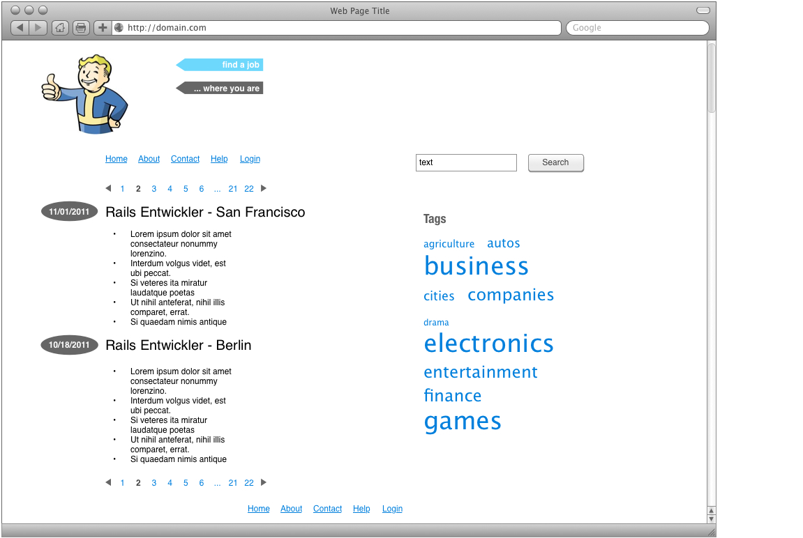
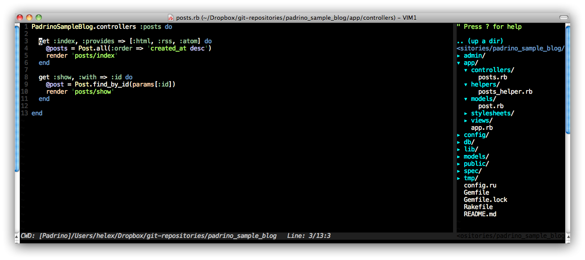

# Introduction #

Why another book about how to develop an application in Rails? But hold, this book should give you a
basic introduction how to develop a web application with [padrino](http://www.padrinorb.com/).
Padrino is a "The Elgant Ruby Web Framework". Is is based on [Rails](http://rubyonrails.org/) and
has some really nice features which makes it easier to create web application with less code and
more fun than to with it's father Rails. To say it with words of the Padrino webpage: "Padrino is a
full-stack ruby framework built upon [Sinatra](http://www.sinatrarb.com/ "Sinatra")".

## Planning the application ##

On the following image you can image you can see the basic image of our application[^omnigraffle]:

[^omnigraffle]: You can use a classical stencil and paper to create mockups. But my handwriting is
so bad that I used [Omnigraffle](http://www.omnigroup.com/products/omnigraffle/ "Omnigraffle") with
the stencil extensions by [konigi](http://konigi.com/tools/omnigraffle-wireframe-stencils "konigi")
for writing wireframes.

## Your environment ##

Nowadays there are a bunch of IDEs out there: [RubyMine by JetBrains](http://www.jetbrains.com/ruby/
"RubyMine") (commercial) [Aptana RadRails](http://www.aptana.com/products/radrails "Aptana
RadRails") (free).  Or you can switch to some text editors [Textmate](http://macromates.com/
"Textmate") (commercial for Mac only), and [Vim](http://www.vim.org/ "vim"), which just run on every
server and under every terminal.

They all have there strength and weak sides. You have to experiment with them and take what fits
your needs. Due to the fact that I will do a bunch of really great command-line, I prefer to use a
"classical" **text editor** (see my [vim-settings repository on
github](https://github.com/matthias-guenther/vim-settings "vim-settings repository on github") if
you want to see which tool I use every day). In the end you have to decide what you want to take.
The main goal is that you are comfortable with it because you will mostly spend a lot of time with
it.

## Your browser ##

Here it is the as with the editors: There are many of them with great plugins out there for
web development. The mostly used browsers by Rails developer are:

- [Firefox](http://www.mozilla.org/en-US/firefox/new/ "Firefox"): Has a tons of plugins, is free,
  and with the magnificent [Firebug](http://getfirebug.com/ "Firebug") plugin, which let you inspect
  HTML document, measure the loading time of certain parts
- [Chrome](http://www.google.com/chrome "Chrome"): This browser is from Google (and I know many
  complains about data privacy).  It feels very fast and is shipped with *inspect element*[^inspect]
  to search the DOM[^dom]. It integrates the ability to debug JavaScript
- [Opera](http://www.opera.com/ "Opera"): Never used it, and don't know why I should (instead you
  tell my why and I will quote your words if they convince me)

There are more outside this main domain, like [Safari by Apple](http://www.apple.com/safari/ "Safari
by Apple"), [Lynx webbrowser](http://lynx.isc.org/ "Lynx webbrowser") (quite an experience to use
just a plain text browser) and the well known [Internet
Explorer](http://windows.microsoft.com/en-US/internet-explorer/downloads/ie "Internet Explorer").
Got out, grab the thing you want, and then gets your hands dirty.

[^inspect]: This is like a Firebug pendant of Firefox.
[^dom]: stands for *Document Object Model* and is a tree-like representation of the HTML page.

## Your system ##

"War... War never changes." this quote from my all-time favorite video game series
[Fallout](http://en.wikipedia.org/wiki/Fallout_(video_game) "Fallout") describes the battle of the
different operating systems. I will briefly give you an overview what you can take

- [Microsoft](http://www.microsoft.com/ "Microsoft"): This commercial operating system is installed
  on a huge range of computers. Much software and games are available for this operation system.
  Updates comes regularly, and everything is mostly intuitive. One big problem of Windows is it's
  mouse affinity: There are shortcuts and handy tips available. It is good for development, but
  lacks some comfort and design issues (you may not know, when you haven't worked with Linux).
- [Unix/Linux](http://en.wikipedia.org/wiki/Linux "Unix/Linux"): Highly configurable, Linux is
  shipped with a bunch of free software, and is Open Source. If you come from the Windows world,
  your brain will be burn like hell because everything is other. The program calls are other, you
  can install new software via *console*, the firewall is safe, and you can run most commands in the
  terminal (no annying mouse clicks anymore if you avoid graphical work). It is great for
  development because the great community are passionate about building software, and most software
  is Open Source so you don't have to pay for it.
- [Mac](http://www.apple.com/mac/ "Mac"): The core under it's has Unix, so you can reuse your Linux
  knowledge. Many people say that products from Apple are very expensive. In the contrast they
  provide you with an extreme stable, high configurable, and reliable system, which has some really
  nice software for it. If you haven't paid for software in your life, some piece of software will
  make you want to pay for it because. In mine eyes, Mac is the gap between Windows and Linux: It
  can be changed in any any way you want (Linux) and has some really good software for it
  (Microsoft). Development on this machine is extreme good, because it underlines the needs of
  developers.

There is a war between these three operation systems, and which you chose is a matter of taste. As
you can see on this pictures, I'm using a Mac. I like and love (and yeah, I had to pay a lot of
patience and learning to come to the point where I can say, that it was worth paying much money for
the hardware).

## Other tools ##

This sections contains a list of several tools you need today for running the project.

### Ruby ###

Padrino is implemented in Ruby. It is flexible, rich, and make it possible for you to turn all the
crazy ideas you have from books, conferences, and blogs into reality. Most ruby programmers (like
[Dave Thomas (calld PragDave)](http://pragdave.pragprog.com/ "Dave Thomas"), or [Chad Fowler (the
passionate programmer)]( "Chad Fowler (the passionate programmer)")). This book will not give you
an introduction to ruby. I recommend the following list of books (for newbies and veterans):

- [Programming ruby](http://pragprog.com/book/ruby3/programming-ruby-1-9 "Programming ruby")
- [why's (poignant) Guide to Ruby](http://www.scribd.com/doc/8545174/Whys-Poignant-Guide-to-Ruby
  "why's (poignant) Guide to Ruby") - written by the nebulous programmer [why the lucky
  stiff](http://en.wikipedia.org/wiki/Why_the_lucky_stiff "why the lucky stiff") in a entertaining
  and educational way.

In this project I will explain you difficult language constructs in ruby - but don't assume that I
will explain them in every way.

### git - versioning your code ###

git helps you to keep track of the changes in your code. You can switch between certain versions in
your code, create branches to experiment with code, and easily manage your code in distributed teams

Recommended books:

- [Pro Git](http://progit.org/ "Pro Git") - this free online book explains you the basic internals
  of git, and how the workflow can be like
- [gitref](http://gitref.org/ "gitref") - page with the basic commands you have to use to be
  productive when working with git

Recommended tools:

- [gitk](http://gitk.sourceforge.net/ "gitk") - gives you a tree-like overview of your git
  repository (it works on every platform)
- [gitx](http://gitx.frim.nl/ "gitx") - branching, merging, committing, you can even stage different
  changes in your code with this tool. It looks like a diamond and checking in your code will make
  you happy
- [fugitive](https://github.com/tpope/vim-fugitive "fugitive") - git wrapper for Vim, very good for
  command-line guys who don't want to leave the editor. Works good, if you are the only person
  working on a project (like I doing writing this book)

In this book I will explain the commands of *git* when they first occur, and repeat the commands
every time I did during the development. Repeating is very important when learning something new.

### heroku ###

The [heroku cloud application platform](http://www.heroku.com/ "ruby gem") enables you to deploy
your Rails application on the heroku platform. It manage the database creation, installation of the
gems - difficult configurations tasks are handled by this platform. Heroku is so attractive that
even the creator of ruby, [Yukihiro
Matsumoto](http://blog.heroku.com/archives/2011/7/12/matz_joins_heroku/ "Yukihiroatsumoto"), works
as *Chief Architect of Ruby* on this platform.
